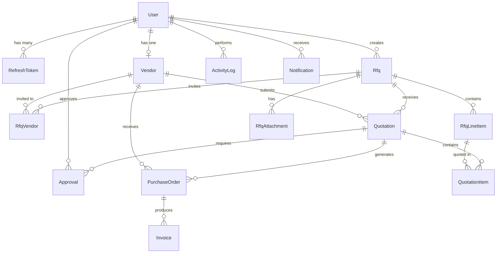

<p align="center">
  
  
  
  
  
</p>

# 🏗️ VendorBridge ERP — Backend API

> **Procurement & Vendor Management ERP** — A RESTful API backend powering the VendorBridge platform for digitized procurement workflows, vendor management, quotation processing, multi-level approvals, purchase order generation, and invoice lifecycle management.

---

## 📑 Table of Contents

- [Overview](#overview)
- [Tech Stack](#tech-stack)
- [Architecture](#architecture)
- [Getting Started](#getting-started)
  - [Prerequisites](#prerequisites)
  - [Installation](#installation)
  - [Environment Variables](#environment-variables)
  - [Database Setup](#database-setup)
  - [Running the Server](#running-the-server)
- [Project Structure](#project-structure)
- [Authentication & Authorization](#authentication--authorization)
  - [JWT Token Flow](#jwt-token-flow)
  - [Role-Based Access Control (RBAC)](#role-based-access-control-rbac)
- [API Response Format](#api-response-format)
- [API Reference](#api-reference)
  - [Health Check](#1-health-check)
  - [Authentication](#2-authentication)
  - [Admin — User Management](#3-admin--user-management)
  - [Vendor Management](#4-vendor-management)
  - [RFQ (Request for Quotation)](#5-rfq-request-for-quotation)
  - [Quotations](#6-quotations)
  - [Approvals](#7-approvals)
  - [Purchase Orders](#8-purchase-orders)
  - [Invoices](#9-invoices)
  - [Dashboard](#10-dashboard)
  - [Reports & Analytics](#11-reports--analytics)
  - [Activity Logs](#12-activity-logs)
  - [Notifications](#13-notifications)
- [Database Schema](#database-schema)
  - [Entity Relationship Diagram](#entity-relationship-diagram)
  - [Enums](#enums)
  - [Models](#models)
- [Email Notifications](#email-notifications)
- [Error Handling](#error-handling)
- [Validation](#validation)

---

## Overview

VendorBridge ERP backend is a **Node.js + Express** REST API that powers the complete procurement lifecycle:

```
Officer creates RFQ → Vendors submit Quotations → Officer selects winner →
L1/L2 Manager Approvals → Purchase Order generated → Invoice created → Payment tracked
```

The backend enforces **role-based access control** across four user roles (Admin, Manager, Officer, Vendor) with a **two-level approval workflow** for procurement decisions.

---

## Tech Stack

| Technology | Purpose |
|---|---|
| **Node.js** | JavaScript runtime |
| **TypeScript** | Type-safe development |
| **Express 5** | HTTP framework |
| **Prisma 7** | ORM & database toolkit |
| **PostgreSQL (Neon)** | Serverless relational database |
| **JWT** | Stateless authentication (access + refresh tokens) |
| **bcrypt** | Password hashing (10 salt rounds) |
| **Zod** | Request validation schemas |
| **Multer** | File upload handling |
| **Resend** | Transactional email delivery |
| **cookie-parser** | HTTP-only cookie management |

---

## Architecture

The backend follows a **layered architecture** pattern for clean separation of concerns:

```
┌─────────────────────────────────────────────┐
│                  Routes                      │  ← HTTP method + path mapping
├─────────────────────────────────────────────┤
│               Middleware                     │  ← Auth, RBAC, Validation
├─────────────────────────────────────────────┤
│              Controllers                     │  ← Request/Response handling
├─────────────────────────────────────────────┤
│               Services                       │  ← Business logic
├─────────────────────────────────────────────┤
│             Repositories                     │  ← Database queries (Prisma)
├─────────────────────────────────────────────┤
│          Prisma ORM + PostgreSQL             │  ← Data persistence
└─────────────────────────────────────────────┘
```

---

## Getting Started

### Prerequisites

- **Node.js** ≥ 18.x
- **npm** ≥ 9.x
- **PostgreSQL** database (recommended: [Neon](https://neon.tech/) serverless Postgres)

### Installation

```bash
# Clone the repository
git clone <repository-url>
cd odoo-hackthon/backend

# Install dependencies
npm install
```

### Environment Variables

Copy the example environment file and fill in your values:

```bash
cp .env.example .env
```

| Variable | Description | Default |
|---|---|---|
| `DATABASE_URL` | Neon PostgreSQL connection string | — **(required)** |
| `PORT` | Express server port | `5001` |
| `FRONTEND_URL` | CORS-allowed frontend origin | `http://localhost:3000` |
| `JWT_SECRET` | Access token signing key | — **(required)** |
| `REFRESH_SECRET` | Refresh token signing key | — **(required)** |
| `RESEND_API_KEY` | Resend API key for email delivery | — *(optional)* |
| `EMAIL_FROM` | Sender email address | `noreply@vendorbridge.com` |
| `UPLOAD_DIR` | File upload directory | `./uploads` |
| `MAX_FILE_SIZE_MB` | Max upload file size in MB | `5` |
| `ORG_NAME` | Organization name (invoice header) | — |
| `ORG_ADDRESS` | Organization address (invoice header) | — |
| `ORG_GSTIN` | Organization GST Number (invoice header) | — |
| `SEED_ADMIN_EMAIL` | Initial admin email (seed only) | `admin@example.com` |
| `SEED_ADMIN_PASSWORD` | Initial admin password (seed only) | `admin123` |

> ⚠️ **Never commit the `.env` file with real secrets. Use strong random keys in production.**

### Database Setup

```bash
# Generate Prisma Client
npx prisma generate

# Push schema to database (creates tables)
npx prisma db push

# Seed initial Admin account + demo data
npx prisma db seed
```

### Running the Server

```bash
# Development (with hot-reload via nodemon)
npm run dev

# Production build
npm run build
npm start
```

The server starts on `http://localhost:5001` by default.

---

## Project Structure

```
backend/
├── prisma/
│   ├── schema.prisma          # Database schema definition
│   └── seed.ts                # Database seeding script
├── prisma.config.ts           # Prisma configuration
├── src/
│   ├── index.ts               # Express app entry point
│   ├── controllers/           # Request/response handlers
│   │   ├── auth.controller.ts
│   │   ├── vendor.controller.ts
│   │   ├── rfq.controller.ts
│   │   ├── quotation.controller.ts
│   │   ├── approval.controller.ts
│   │   ├── purchaseOrder.controller.ts
│   │   ├── invoice.controller.ts
│   │   ├── admin.controller.ts
│   │   ├── dashboard.controller.ts
│   │   ├── report.controller.ts
│   │   ├── activityLog.controller.ts
│   │   ├── notification.controller.ts
│   │   └── health.controller.ts
│   ├── services/              # Business logic layer
│   │   ├── rfq.service.ts
│   │   ├── quotation.service.ts
│   │   ├── approval.service.ts
│   │   ├── purchaseOrder.service.ts
│   │   ├── invoice.service.ts
│   │   ├── vendor.service.ts
│   │   ├── dashboard.service.ts
│   │   ├── report.service.ts
│   │   ├── activityLog.service.ts
│   │   └── notification.service.ts
│   ├── repositories/          # Data access layer (Prisma queries)
│   │   ├── rfq.repository.ts
│   │   ├── quotation.repository.ts
│   │   ├── approval.repository.ts
│   │   ├── purchaseOrder.repository.ts
│   │   ├── invoice.repository.ts
│   │   ├── vendor.repository.ts
│   │   ├── report.repository.ts
│   │   ├── activityLog.repository.ts
│   │   └── notification.repository.ts
│   ├── routes/                # Express route definitions
│   │   ├── auth.routes.ts
│   │   ├── vendor.routes.ts
│   │   ├── rfq.routes.ts
│   │   ├── quotation.routes.ts
│   │   ├── approval.routes.ts
│   │   ├── purchaseOrder.routes.ts
│   │   ├── invoice.routes.ts
│   │   ├── admin.routes.ts
│   │   ├── dashboard.routes.ts
│   │   ├── report.routes.ts
│   │   ├── activityLog.routes.ts
│   │   ├── notification.routes.ts
│   │   └── health.routes.ts
│   ├── middleware/            # Express middleware
│   │   ├── auth.ts            # JWT authentication
│   │   ├── roleGuard.ts       # Role-based access control
│   │   ├── validate.ts        # Zod schema validation
│   │   └── errorHandler.ts    # Global error handler
│   ├── validations/           # Zod validation schemas
│   │   ├── auth.validation.ts
│   │   ├── vendor.validation.ts
│   │   ├── rfq.validation.ts
│   │   ├── quotation.validation.ts
│   │   ├── approval.validation.ts
│   │   ├── purchaseOrder.validation.ts
│   │   └── invoice.validation.ts
│   ├── lib/                   # Shared utilities
│   │   ├── prisma.ts          # Prisma client singleton
│   │   ├── response.ts        # Standardized response helpers
│   │   ├── email.ts           # Email templates (Resend)
│   │   └── activityLogger.ts  # Activity log helper
│   └── types/
│       └── index.ts           # TypeScript type definitions
├── uploads/                   # File upload storage
├── ai/                        # AI context & guide documents
├── package.json
├── tsconfig.json
└── .env.example
```

---

## Authentication & Authorization

### JWT Token Flow

The API uses a **dual-token strategy** with HTTP-only cookies:

| Token | Storage | Lifetime | Purpose |
|---|---|---|---|
| **Access Token** | `accessToken` cookie | 30 minutes | API request authentication |
| **Refresh Token** | `refreshToken` cookie + DB | 7 days | Obtain new access tokens |

**Flow:**
1. User **registers** → Account created with `isActive: false` (pending Admin activation)
2. Admin **activates** the user account
3. User **logs in** → Access + Refresh tokens set as HTTP-only cookies
4. Client includes cookies automatically with each request
5. On **401 expiry**, client calls `/refresh` to rotate the access token
6. On **logout**, refresh token is revoked from DB and cookies are cleared

**Token extraction order:** Cookie `accessToken` → `Authorization: Bearer <token>` header

### Role-Based Access Control (RBAC)

Four roles with hierarchical permissions:

| Role | Description | Key Permissions |
|---|---|---|
| **ADMIN** | System administrator | Full access. Manage users, activate accounts, set approval levels. Created only via seed. |
| **MANAGER** | Approval authority | Review and approve/reject quotations (L1/L2 levels). View RFQs, POs, reports. |
| **OFFICER** | Procurement officer | Create RFQs, onboard vendors, select quotations, generate POs and invoices. |
| **VENDOR** | External supplier | View assigned RFQs, submit/update quotation bids, view own POs. |

> 🔒 **ADMIN accounts cannot be self-registered.** They are created exclusively via the database seed script.

---

## API Response Format

All API responses follow a standardized JSON envelope:

### Success Response

```json
{
  "success": true,
  "data": { ... }
}
```

### Error Response

```json
{
  "success": false,
  "error": "Human-readable error message",
  "fields": {                          // Optional: validation errors
    "email": ["Email is required"],
    "password": ["Password must be at least 6 characters"]
  }
}
```

---

## API Reference

**Base URL:** `http://localhost:5001`

---

### 1. Health Check

#### `GET /api/health`

Check server and database connectivity status.

**Auth:** None

**Response:**
```json
{
  "status": "ok",
  "timestamp": "2026-06-06T10:00:00.000Z",
  "uptime": 3600.123,
  "database": {
    "status": "connected",
    "error": null
  }
}
```

---

### 2. Authentication

**Base Path:** `/api/v1/auth`

---

#### `POST /api/v1/auth/register`

Register a new user account. Account is created as **inactive** and requires Admin activation before login.

**Auth:** None

**Request Body:**
```json
{
  "email": "officer@example.com",
  "password": "securepass123",
  "firstName": "Raj",
  "lastName": "Patel",
  "role": "OFFICER",
  "phone": "9876543210",
  "country": "India",
  "profilePhoto": "https://example.com/photo.jpg"
}
```

| Field | Type | Required | Validation |
|---|---|---|---|
| `email` | `string` | ✅ | Valid email format, auto-lowercased |
| `password` | `string` | ✅ | Min 6 characters |
| `firstName` | `string` | ✅ | Non-empty |
| `lastName` | `string` | ✅ | Non-empty |
| `role` | `string` | ❌ | `OFFICER` (default), `VENDOR`, `MANAGER`. **ADMIN is forbidden.** |
| `phone` | `string` | ❌ | Exactly 10 digits |
| `country` | `string` | ❌ | — |
| `profilePhoto` | `string` | ❌ | URL string |

**Response (201):**
```json
{
  "success": true,
  "data": {
    "user": {
      "id": 5,
      "email": "officer@example.com",
      "firstName": "Raj",
      "lastName": "Patel",
      "role": "OFFICER",
      "phone": "9876543210",
      "country": "India",
      "isActive": false
    },
    "message": "Registration successful. Your account is pending Admin approval. You will be notified once activated."
  }
}
```

**Side Effects:** Sends email notification to all active Admin users.

---

#### `POST /api/v1/auth/login`

Authenticate and receive JWT tokens via HTTP-only cookies.

**Auth:** None

**Request Body:**
```json
{
  "email": "officer@example.com",
  "password": "securepass123"
}
```

| Field | Type | Required | Validation |
|---|---|---|---|
| `email` | `string` | ✅ | Valid email |
| `password` | `string` | ✅ | Non-empty |

**Response (200):**
```json
{
  "success": true,
  "data": {
    "user": {
      "id": 5,
      "email": "officer@example.com",
      "firstName": "Raj",
      "lastName": "Patel",
      "role": "OFFICER",
      "phone": "9876543210",
      "country": "India",
      "profilePhoto": null
    }
  }
}
```

**Cookies Set:**
- `accessToken` — HttpOnly, 30min TTL
- `refreshToken` — HttpOnly, 7 day TTL

**Error Cases:**
- `401` — Invalid email or password
- `403` — Account pending activation

---

#### `POST /api/v1/auth/refresh`

Exchange a valid refresh token for a new access token.

**Auth:** Refresh token (cookie or body)

**Request Body (optional):**
```json
{
  "refreshToken": "<token>"
}
```

**Response (200):**
```json
{
  "success": true,
  "data": { "message": "Token refreshed successfully." }
}
```

---

#### `POST /api/v1/auth/logout`

Revoke refresh token and clear authentication cookies.

**Auth:** Refresh token (cookie or body)

**Response (200):**
```json
{
  "success": true,
  "data": { "message": "Successfully logged out." }
}
```

---

#### `GET /api/v1/auth/me`

Get the currently authenticated user's profile.

**Auth:** 🔐 Required

**Response (200):**
```json
{
  "success": true,
  "data": {
    "user": {
      "id": 5,
      "email": "officer@example.com",
      "firstName": "Raj",
      "lastName": "Patel",
      "role": "OFFICER",
      "phone": "9876543210",
      "country": "India",
      "isActive": true,
      "profilePhoto": null
    }
  }
}
```

---

#### `GET /api/v1/auth/users`

List all users with optional role filter.

**Auth:** 🔐 Required

**Query Parameters:**

| Param | Type | Description |
|---|---|---|
| `role` | `string` | Filter by role: `ADMIN`, `MANAGER`, `OFFICER`, `VENDOR` |

**Response (200):**
```json
{
  "success": true,
  "data": {
    "users": [
      {
        "id": 1,
        "email": "admin@example.com",
        "firstName": "Admin",
        "lastName": "User",
        "role": "ADMIN",
        "isActive": true
      }
    ]
  }
}
```

---

### 3. Admin — User Management

**Base Path:** `/api/v1/admin`

**Auth:** 🔐 Required — **ADMIN only**

---

#### `GET /api/v1/admin/users`

List all users with detailed information including approval levels.

**Response (200):**
```json
{
  "success": true,
  "data": {
    "users": [
      {
        "id": 1,
        "email": "admin@example.com",
        "firstName": "Admin",
        "lastName": "User",
        "role": "ADMIN",
        "isActive": true,
        "approvalLevel": null,
        "createdAt": "2026-06-01T00:00:00.000Z",
        "updatedAt": "2026-06-01T00:00:00.000Z"
      }
    ]
  }
}
```

---

#### `PATCH /api/v1/admin/users/:id/activate`

Toggle a user's active status (activate/deactivate).

**Path Parameters:**

| Param | Type | Description |
|---|---|---|
| `id` | `integer` | User ID |

**Response (200):**
```json
{
  "success": true,
  "data": {
    "user": {
      "id": 5,
      "email": "officer@example.com",
      "firstName": "Raj",
      "lastName": "Patel",
      "role": "OFFICER",
      "isActive": true
    }
  }
}
```

**Side Effects:** Sends activation email to the user when activating.

---

#### `PATCH /api/v1/admin/users/:id/approval-level`

Set the approval level for a MANAGER user.

**Path Parameters:**

| Param | Type | Description |
|---|---|---|
| `id` | `integer` | User ID (must be a MANAGER) |

**Request Body:**
```json
{
  "approvalLevel": 1
}
```

| Field | Type | Required | Validation |
|---|---|---|---|
| `approvalLevel` | `number \| null` | ✅ | Must be `null`, `1` (L1), or `2` (L2) |

**Response (200):**
```json
{
  "success": true,
  "data": {
    "user": {
      "id": 3,
      "email": "manager@example.com",
      "firstName": "Priya",
      "lastName": "Shah",
      "role": "MANAGER",
      "approvalLevel": 1
    }
  }
}
```

---

### 4. Vendor Management

**Base Path:** `/api/v1/vendors`

---

#### `GET /api/v1/vendors`

List all vendors with pagination, search, and filtering.

**Auth:** 🔐 ADMIN, MANAGER, OFFICER

**Query Parameters:**

| Param | Type | Description |
|---|---|---|
| `search` | `string` | Search by company name |
| `category` | `string` | Filter by vendor category |
| `status` | `string` | Filter by status: `PENDING`, `ACTIVE`, `BLOCKED` |
| `page` | `number` | Page number (default: `1`) |
| `limit` | `number` | Items per page (default: `20`) |

**Response (200):**
```json
{
  "success": true,
  "data": {
    "vendors": [
      {
        "id": 1,
        "companyName": "TechCorp Solutions",
        "gstNumber": "27AABCU9603R1ZX",
        "category": "IT Services",
        "contactNumber": "9876543210",
        "address": "Mumbai, Maharashtra",
        "status": "ACTIVE",
        "user": { "email": "vendor@techcorp.com", "firstName": "Amit", "lastName": "Kumar" }
      }
    ],
    "pagination": {
      "total": 25,
      "page": 1,
      "limit": 20,
      "totalPages": 2
    }
  }
}
```

---

#### `GET /api/v1/vendors/:id`

Get detailed information for a specific vendor.

**Auth:** 🔐 ADMIN, MANAGER, OFFICER, VENDOR

**Response (200):**
```json
{
  "success": true,
  "data": {
    "vendor": {
      "id": 1,
      "userId": 5,
      "companyName": "TechCorp Solutions",
      "gstNumber": "27AABCU9603R1ZX",
      "category": "IT Services",
      "contactNumber": "9876543210",
      "address": "Mumbai, Maharashtra",
      "status": "ACTIVE",
      "createdAt": "2026-06-01T00:00:00.000Z",
      "updatedAt": "2026-06-01T00:00:00.000Z"
    }
  }
}
```

---

#### `POST /api/v1/vendors`

Onboard a new vendor by mapping a VENDOR-role user to a company profile.

**Auth:** 🔐 ADMIN, OFFICER

**Request Body:**
```json
{
  "userId": 5,
  "companyName": "TechCorp Solutions",
  "gstNumber": "27AABCU9603R1ZX",
  "category": "IT Services",
  "contactNumber": "9876543210",
  "address": "123 Tech Park, Mumbai, Maharashtra"
}
```

| Field | Type | Required | Validation |
|---|---|---|---|
| `userId` | `number` | ✅ | Must reference a VENDOR-role user |
| `companyName` | `string` | ✅ | Non-empty |
| `gstNumber` | `string` | ✅ | Exactly 15 characters, auto-uppercased |
| `category` | `string` | ✅ | Non-empty |
| `contactNumber` | `string` | ✅ | Non-empty |
| `address` | `string` | ✅ | Non-empty |

**Response (201):**
```json
{
  "success": true,
  "data": { "vendor": { ... } }
}
```

---

#### `PATCH /api/v1/vendors/:id`

Update a vendor's profile information or status.

**Auth:** 🔐 ADMIN, OFFICER

**Request Body (all fields optional):**
```json
{
  "companyName": "TechCorp Solutions Pvt. Ltd.",
  "status": "ACTIVE"
}
```

| Field | Type | Validation |
|---|---|---|
| `companyName` | `string` | Non-empty |
| `gstNumber` | `string` | Exactly 15 characters |
| `category` | `string` | Non-empty |
| `contactNumber` | `string` | Non-empty |
| `address` | `string` | Non-empty |
| `status` | `string` | `PENDING`, `ACTIVE`, `BLOCKED` |

---

### 5. RFQ (Request for Quotation)

**Base Path:** `/api/v1/rfqs`

---

#### `GET /api/v1/rfqs`

List RFQs. Vendors see only RFQs they are invited to.

**Auth:** 🔐 ADMIN, MANAGER, OFFICER, VENDOR

**Query Parameters:**

| Param | Type | Description |
|---|---|---|
| `status` | `string` | Filter: `DRAFT`, `PUBLISHED`, `CLOSED` |
| `page` | `number` | Page number (default: `1`) |
| `limit` | `number` | Items per page (default: `20`) |

**Response (200):**
```json
{
  "success": true,
  "data": {
    "rfqs": [
      {
        "id": 1,
        "title": "Office Furniture Procurement",
        "category": "Furniture",
        "description": "Requirement for 50 office desks and chairs",
        "deadline": "2026-07-01T00:00:00.000Z",
        "status": "PUBLISHED",
        "createdBy": 2,
        "lineItems": [...],
        "rfqVendors": [...],
        "attachments": [...]
      }
    ],
    "pagination": { "total": 10, "page": 1, "limit": 20, "totalPages": 1 }
  }
}
```

---

#### `GET /api/v1/rfqs/:id`

Get detailed RFQ with line items, assigned vendors, attachments, and quotations.

**Auth:** 🔐 ADMIN, MANAGER, OFFICER, VENDOR (assigned only)

---

#### `POST /api/v1/rfqs`

Create a new RFQ with line items, vendor assignments, and optional attachments.

**Auth:** 🔐 ADMIN, OFFICER

**Request Body:**
```json
{
  "title": "Office Furniture Procurement",
  "category": "Furniture",
  "description": "Requirement for 50 office desks and ergonomic chairs",
  "deadline": "2026-07-15T23:59:59.000Z",
  "lineItems": [
    { "itemName": "Office Desk", "quantity": 50, "unit": "pcs" },
    { "itemName": "Ergonomic Chair", "quantity": 50, "unit": "pcs" }
  ],
  "assignedVendorIds": [1, 3, 5],
  "attachments": [
    { "fileName": "specs.pdf", "filePath": "/uploads/rfqs/1717680000-specs.pdf" }
  ]
}
```

| Field | Type | Required | Validation |
|---|---|---|---|
| `title` | `string` | ✅ | Non-empty |
| `category` | `string` | ✅ | Non-empty |
| `description` | `string` | ✅ | Non-empty |
| `deadline` | `string` | ✅ | ISO 8601 datetime, must be in the future |
| `lineItems` | `array` | ✅ | Min 1 item. Each: `itemName` (string), `quantity` (positive int), `unit` (string) |
| `assignedVendorIds` | `number[]` | ✅ | Min 1 vendor ID |
| `attachments` | `array` | ❌ | Each: `fileName` (string), `filePath` (string) |

**Response (201):** Created RFQ object with all relations.

---

#### `PUT /api/v1/rfqs/:id`

Update a DRAFT RFQ. Cannot update PUBLISHED or CLOSED RFQs.

**Auth:** 🔐 ADMIN, OFFICER

**Request Body:** Same structure as create, all fields optional.

---

#### `POST /api/v1/rfqs/upload`

Upload a file attachment for an RFQ.

**Auth:** 🔐 ADMIN, OFFICER

**Request:** `multipart/form-data` with field name `file`

**Response (200):**
```json
{
  "success": true,
  "data": {
    "fileName": "specifications.pdf",
    "filePath": "/uploads/rfqs/1717680000-123456789.pdf"
  }
}
```

---

#### `POST /api/v1/rfqs/:id/send`

Publish a DRAFT RFQ and send it to all assigned vendors.

**Auth:** 🔐 ADMIN, OFFICER

**Response (200):**
```json
{
  "success": true,
  "data": { "rfq": { "id": 1, "status": "PUBLISHED", ... } }
}
```

**Side Effects:** Sends RFQ invitation email to all assigned vendors.

---

#### `POST /api/v1/rfqs/:rfqId/select-vendor`

Select a winning quotation for an RFQ, triggering the L1/L2 approval workflow.

**Auth:** 🔐 ADMIN, OFFICER

**Request Body:**
```json
{
  "quotationId": 7
}
```

| Field | Type | Required | Description |
|---|---|---|---|
| `quotationId` | `number` | ✅ | ID of the winning quotation |

**Response (200):**
```json
{
  "success": true,
  "data": { "quotation": { "id": 7, "status": "SELECTED", ... } }
}
```

**Side Effects:**
- Selected quotation status → `SELECTED`
- Other quotations for same RFQ → `REJECTED`
- RFQ status → `CLOSED`
- L1 Approval record created and assigned to L1 Manager
- Email notifications sent

---

### 6. Quotations

**Base Path:** `/api/v1/quotations`

---

#### `GET /api/v1/quotations`

List quotations. Vendors see only their own quotations.

**Auth:** 🔐 ADMIN, MANAGER, OFFICER, VENDOR

**Query Parameters:**

| Param | Type | Description |
|---|---|---|
| `rfqId` | `number` | Filter by RFQ ID |
| `vendorId` | `number` | Filter by vendor ID (forced for VENDOR role) |
| `status` | `string` | Filter: `DRAFT`, `SUBMITTED`, `SELECTED`, `REJECTED` |

---

#### `GET /api/v1/quotations/:id`

Get detailed quotation with line items, RFQ info, and vendor details.

**Auth:** 🔐 ADMIN, MANAGER, OFFICER, VENDOR (own only)

---

#### `POST /api/v1/quotations`

Submit a new quotation bid against a published RFQ.

**Auth:** 🔐 VENDOR only

**Request Body:**
```json
{
  "rfqId": 1,
  "gstPercent": 18,
  "status": "SUBMITTED",
  "items": [
    { "rfqLineItemId": 1, "unitPrice": 12500.00, "deliveryDays": 14 },
    { "rfqLineItemId": 2, "unitPrice": 8900.00, "deliveryDays": 14 }
  ]
}
```

| Field | Type | Required | Validation |
|---|---|---|---|
| `rfqId` | `number` | ✅ | Positive integer |
| `gstPercent` | `number` | ✅ | 0–100 |
| `status` | `string` | ❌ | `DRAFT` (default) or `SUBMITTED` |
| `items` | `array` | ✅ | Min 1. Each: `rfqLineItemId`, `unitPrice` (≥0), `deliveryDays` (≥0) |

**Auto-calculated fields:** `subtotal`, `taxAmount`, `grandTotal`

---

#### `PUT /api/v1/quotations/:id`

Update a DRAFT quotation. Cannot update submitted quotations.

**Auth:** 🔐 VENDOR only

---

### 7. Approvals

**Base Path:** `/api/v1/approvals`

**Auth:** 🔐 Required — **MANAGER only**

The approval system uses a **two-level workflow:**
1. **L1 Approval** — First-level manager review
2. **L2 Approval** — Second-level manager review (only after L1 approval)

---

#### `GET /api/v1/approvals`

List approvals assigned to the current manager.

**Query Parameters:**

| Param | Type | Description |
|---|---|---|
| `status` | `string` | Filter: `WAITING`, `PENDING`, `APPROVED`, `REJECTED` |

**Response (200):**
```json
{
  "success": true,
  "data": {
    "approvals": [
      {
        "id": 1,
        "quotationId": 7,
        "approverId": 3,
        "level": 1,
        "status": "PENDING",
        "remarks": null,
        "assignedAt": "2026-06-05T10:00:00.000Z",
        "actionedAt": null,
        "quotation": { ... }
      }
    ]
  }
}
```

---

#### `GET /api/v1/approvals/:id`

Get approval detail with full quotation, RFQ, and vendor information.

---

#### `POST /api/v1/approvals/:id/approve`

Approve an approval request. If L1, triggers L2 approval. If L2, generates a Purchase Order.

**Request Body:**
```json
{
  "remarks": "Pricing is competitive. Approved for procurement."
}
```

| Field | Type | Required | Validation |
|---|---|---|---|
| `remarks` | `string` | ✅ | 1–500 characters |

**Response (200):**
```json
{
  "success": true,
  "data": {
    "approval": { "id": 1, "status": "APPROVED", ... },
    "message": "L1 approved. L2 approval initiated."
  }
}
```

**Side Effects (L1 Approve):** Creates L2 Approval, notifies L2 Manager via email.
**Side Effects (L2 Approve):** Auto-generates Purchase Order, notifies vendor via email.

---

#### `POST /api/v1/approvals/:id/reject`

Reject an approval request. Rejection at any level ends the workflow.

**Request Body:**
```json
{
  "remarks": "Budget exceeded. Requesting revised quotation."
}
```

---

### 8. Purchase Orders

**Base Path:** `/api/v1/purchase-orders`

---

#### `GET /api/v1/purchase-orders`

List purchase orders with pagination. Vendors see only their own POs.

**Auth:** 🔐 ADMIN, MANAGER, OFFICER, VENDOR

**Query Parameters:**

| Param | Type | Description |
|---|---|---|
| `status` | `string` | Filter: `DRAFT`, `APPROVED`, `FULFILLED` |
| `page` | `number` | Page number (default: `1`) |
| `limit` | `number` | Items per page (default: `20`) |

**Response (200):**
```json
{
  "success": true,
  "data": {
    "purchaseOrders": [
      {
        "id": 1,
        "poNumber": "PO-2026-0001",
        "quotationId": 7,
        "vendorId": 1,
        "totalAmount": "125000.00",
        "status": "APPROVED",
        "vendor": { "companyName": "TechCorp Solutions" },
        "quotation": { "rfq": { "title": "Office Furniture" } }
      }
    ],
    "pagination": { ... }
  }
}
```

---

#### `GET /api/v1/purchase-orders/:id`

Get detailed purchase order with vendor, quotation, and RFQ info.

**Auth:** 🔐 ADMIN, MANAGER, OFFICER, VENDOR (own only)

---

#### `PATCH /api/v1/purchase-orders/:id/status`

Update purchase order status.

**Auth:** 🔐 ADMIN, OFFICER

**Request Body:**
```json
{
  "status": "FULFILLED"
}
```

| Field | Type | Required | Validation |
|---|---|---|---|
| `status` | `string` | ✅ | `DRAFT`, `APPROVED`, `FULFILLED` |

---

### 9. Invoices

**Base Path:** `/api/v1/invoices`

---

#### `GET /api/v1/invoices`

List all invoices with pagination.

**Auth:** 🔐 OFFICER, ADMIN, MANAGER

**Query Parameters:**

| Param | Type | Description |
|---|---|---|
| `status` | `string` | Filter: `PENDING_PAYMENT`, `PAID`, `OVERDUE` |
| `page` | `number` | Page number (default: `1`) |
| `limit` | `number` | Items per page (default: `20`) |

---

#### `GET /api/v1/invoices/:id`

Get detailed invoice with PO, vendor, and tax breakdown.

**Auth:** 🔐 OFFICER, ADMIN, MANAGER

---

#### `POST /api/v1/invoices`

Generate an invoice from an approved purchase order.

**Auth:** 🔐 OFFICER, ADMIN

**Request Body:**
```json
{
  "poId": 1,
  "invoiceDate": "2026-06-06",
  "dueDate": "2026-07-06"
}
```

| Field | Type | Required | Validation |
|---|---|---|---|
| `poId` | `number` | ✅ | Positive integer, PO must be APPROVED |
| `invoiceDate` | `string` | ✅ | Date string |
| `dueDate` | `string` | ✅ | Date string |

**Auto-calculated fields:** `invoiceNumber`, `subtotal`, `cgst`, `sgst`, `grandTotal`

**Error Cases:**
- `400` — PO must be in APPROVED status
- `404` — PO not found
- `409` — Invoice already generated for this PO

**Side Effects:** Sends invoice email to the vendor.

---

#### `PATCH /api/v1/invoices/:id/pay`

Mark an invoice as paid.

**Auth:** 🔐 OFFICER, ADMIN

**Request Body:**
```json
{
  "paidRemarks": "Payment processed via NEFT. Ref: TXN123456"
}
```

---

### 10. Dashboard

**Base Path:** `/api/v1/dashboard`

---

#### `GET /api/v1/dashboard/metrics`

Get role-aware dashboard metrics and KPIs.

**Auth:** 🔐 Required (any authenticated user)

**Response (200):**
```json
{
  "success": true,
  "data": {
    "metrics": {
      "pendingAccounts": 3,
      "activeUsers": 15,
      "totalActivityLogs": 247,
      "activeRfqs": 8,
      "registeredVendors": 12,
      "pendingApprovals": 2,
      "totalPoSpend": 1250000,
      "pendingSignOff": 1,
      "approvedToday": 2,
      "monthlySpendAuthorized": 450000,
      "invitedRfqs": 5,
      "submittedBids": 3,
      "unpaidInvoices": 75000
    }
  }
}
```

| Metric | Description | Relevant Role |
|---|---|---|
| `pendingAccounts` | Users awaiting activation | Admin |
| `activeUsers` | Total active users | Admin |
| `totalActivityLogs` | Total audit log entries | Admin |
| `activeRfqs` | Published (open) RFQs | All |
| `registeredVendors` | Active vendors | Admin, Officer |
| `pendingApprovals` | Approvals in PENDING state | Manager |
| `totalPoSpend` | Sum of all non-draft POs | Admin, Officer |
| `pendingSignOff` | Current user's pending approvals | Manager |
| `approvedToday` | Current user's approvals today | Manager |
| `monthlySpendAuthorized` | This month's PO spend | Admin, Officer |
| `invitedRfqs` | RFQs vendor is invited to | Vendor |
| `submittedBids` | Vendor's submitted quotations | Vendor |
| `unpaidInvoices` | Vendor's unpaid invoice total | Vendor |

---

### 11. Reports & Analytics

**Base Path:** `/api/v1/reports`

---

#### `GET /api/v1/reports/overview`

Get procurement overview statistics.

**Auth:** 🔐 ADMIN, OFFICER, MANAGER, VENDOR

**Query Parameters:**

| Param | Type | Description |
|---|---|---|
| `month` | `string` | Filter by month (e.g., `2026-06`) |

---

#### `GET /api/v1/reports/spend-trend`

Get monthly spending trend data for charts.

**Auth:** 🔐 ADMIN, OFFICER, MANAGER

**Query Parameters:**

| Param | Type | Description |
|---|---|---|
| `month` | `string` | Filter by month |

---

#### `GET /api/v1/reports/spend-by-vendor`

Get spending breakdown grouped by vendor.

**Auth:** 🔐 ADMIN, OFFICER, MANAGER

---

#### `GET /api/v1/reports/export/csv`

Export procurement data as a downloadable CSV file.

**Auth:** 🔐 ADMIN, OFFICER, MANAGER

**Response:** `text/csv` file download

**Response Headers:**
```
Content-Type: text/csv
Content-Disposition: attachment; filename="vendorbridge-report-2026-06-06.csv"
```

---

### 12. Activity Logs

**Base Path:** `/api/v1/activity-logs`

---

#### `GET /api/v1/activity-logs`

List audit trail / activity log entries with pagination. Results are scoped by user role.

**Auth:** 🔐 ADMIN, OFFICER, MANAGER, VENDOR

**Query Parameters:**

| Param | Type | Description |
|---|---|---|
| `actionTypes` | `string` | Filter by action type(s): `USER`, `VENDOR`, `RFQ`, `QUOTATION`, `APPROVAL`, `PO`, `INVOICE`, `SYSTEM` |
| `page` | `number` | Page number (default: `1`) |
| `limit` | `number` | Items per page (default: `20`) |

**Response (200):**
```json
{
  "success": true,
  "data": {
    "logs": [
      {
        "id": 1,
        "actorId": 2,
        "actionType": "RFQ",
        "description": "Created RFQ: Office Furniture Procurement",
        "entityId": 1,
        "entityType": "Rfq",
        "createdAt": "2026-06-05T10:30:00.000Z",
        "actor": { "firstName": "Raj", "lastName": "Patel" }
      }
    ],
    "pagination": { ... }
  }
}
```

---

#### `GET /api/v1/activity-logs/:id`

Get a single activity log entry's full details.

**Auth:** 🔐 ADMIN, OFFICER, MANAGER, VENDOR

---

### 13. Notifications

**Base Path:** `/api/v1/notifications`

---

#### `GET /api/v1/notifications`

List notifications for the current user with filtering and pagination.

**Auth:** 🔐 Required

**Query Parameters:**

| Param | Type | Description |
|---|---|---|
| `type` | `string` | Filter by notification type |
| `read` | `string` | Filter: `true` (read only), `false` (unread only) |
| `page` | `number` | Page number (default: `1`) |
| `limit` | `number` | Items per page (default: `20`, max: `50`) |

---

#### `GET /api/v1/notifications/unread-count`

Get the count of unread notifications.

**Auth:** 🔐 Required

**Response (200):**
```json
{
  "success": true,
  "data": { "count": 5 }
}
```

---

#### `PATCH /api/v1/notifications/:id/read`

Mark a single notification as read.

**Auth:** 🔐 Required

---

#### `POST /api/v1/notifications/read-all`

Mark all notifications as read for the current user.

**Auth:** 🔐 Required

---

## Database Schema

### Entity Relationship Diagram



### Enums

| Enum | Values | Description |
|---|---|---|
| `Role` | `ADMIN`, `MANAGER`, `OFFICER`, `VENDOR` | User access roles |
| `VendorStatus` | `PENDING`, `ACTIVE`, `BLOCKED` | Vendor account status |
| `RfqStatus` | `DRAFT`, `PUBLISHED`, `CLOSED` | RFQ lifecycle status |
| `QuotationStatus` | `DRAFT`, `SUBMITTED`, `SELECTED`, `REJECTED` | Quotation workflow status |
| `ApprovalStatus` | `WAITING`, `PENDING`, `APPROVED`, `REJECTED` | Approval state machine |
| `PoStatus` | `DRAFT`, `APPROVED`, `FULFILLED` | Purchase order lifecycle |
| `InvoiceStatus` | `PENDING_PAYMENT`, `PAID`, `OVERDUE` | Invoice payment status |
| `LogActionType` | `USER`, `VENDOR`, `RFQ`, `QUOTATION`, `APPROVAL`, `PO`, `INVOICE`, `SYSTEM` | Activity log categories |

### Models

#### User

| Column | Type | Constraints | Description |
|---|---|---|---|
| `id` | `Int` | PK, auto-increment | Unique identifier |
| `email` | `String` | Unique | Login email |
| `passwordHash` | `String` | — | bcrypt-hashed password |
| `firstName` | `String` | — | First name |
| `lastName` | `String` | — | Last name |
| `role` | `Role` | Default: `OFFICER` | User role |
| `phone` | `String?` | Optional | Phone number |
| `country` | `String?` | Optional | Country |
| `profilePhoto` | `String?` | Optional | Profile photo URL |
| `isActive` | `Boolean` | Default: `false` | Account activation status |
| `approvalLevel` | `Int?` | Optional | 1 (L1) or 2 (L2) — Manager only |
| `createdAt` | `DateTime` | Auto | Creation timestamp |
| `updatedAt` | `DateTime` | Auto | Last update timestamp |

#### Vendor

| Column | Type | Constraints | Description |
|---|---|---|---|
| `id` | `Int` | PK, auto-increment | Unique identifier |
| `userId` | `Int` | Unique, FK → User | Mapped user account |
| `companyName` | `String` | — | Company name |
| `gstNumber` | `String` | Unique | 15-char GSTIN |
| `category` | `String` | — | Vendor category |
| `contactNumber` | `String` | — | Business phone |
| `address` | `String` | — | Business address |
| `status` | `VendorStatus` | Default: `PENDING` | Account status |
| `createdAt` | `DateTime` | Auto | — |
| `updatedAt` | `DateTime` | Auto | — |

#### Rfq

| Column | Type | Constraints | Description |
|---|---|---|---|
| `id` | `Int` | PK | — |
| `title` | `String` | — | RFQ title |
| `category` | `String` | — | Procurement category |
| `description` | `String` | — | Detailed description |
| `deadline` | `DateTime` | — | Submission deadline |
| `status` | `RfqStatus` | Default: `DRAFT` | Lifecycle status |
| `createdBy` | `Int` | FK → User | Creator |
| `createdAt` | `DateTime` | Auto | — |
| `updatedAt` | `DateTime` | Auto | — |

#### RfqLineItem

| Column | Type | Description |
|---|---|---|
| `id` | `Int` | PK |
| `rfqId` | `Int` | FK → Rfq |
| `itemName` | `String` | Item name |
| `quantity` | `Int` | Required quantity |
| `unit` | `String` | Unit of measure (pcs, kg, etc.) |

#### RfqVendor (Junction Table)

| Column | Type | Constraints | Description |
|---|---|---|---|
| `id` | `Int` | PK | — |
| `rfqId` | `Int` | FK → Rfq | — |
| `vendorId` | `Int` | FK → Vendor | — |
| `invitedAt` | `DateTime` | Auto | Invitation timestamp |
| — | — | Unique(`rfqId`, `vendorId`) | Prevents duplicate invitations |

#### RfqAttachment

| Column | Type | Description |
|---|---|---|
| `id` | `Int` | PK |
| `rfqId` | `Int` | FK → Rfq |
| `fileName` | `String` | Original filename |
| `filePath` | `String` | Server storage path |
| `uploadedAt` | `DateTime` | Upload timestamp |

#### Quotation

| Column | Type | Constraints | Description |
|---|---|---|---|
| `id` | `Int` | PK | — |
| `rfqId` | `Int` | FK → Rfq | Referenced RFQ |
| `vendorId` | `Int` | FK → Vendor | Submitting vendor |
| `gstPercent` | `Decimal(5,2)` | — | GST percentage |
| `subtotal` | `Decimal(12,2)` | — | Pre-tax total |
| `taxAmount` | `Decimal(12,2)` | — | Computed tax |
| `grandTotal` | `Decimal(12,2)` | — | Final total |
| `status` | `QuotationStatus` | Default: `DRAFT` | Workflow status |

#### QuotationItem

| Column | Type | Description |
|---|---|---|
| `id` | `Int` | PK |
| `quotationId` | `Int` | FK → Quotation |
| `rfqLineItemId` | `Int` | FK → RfqLineItem |
| `unitPrice` | `Decimal(12,2)` | Price per unit |
| `totalPrice` | `Decimal(12,2)` | quantity × unitPrice |
| `deliveryDays` | `Int` | Estimated delivery days |

#### Approval

| Column | Type | Description |
|---|---|---|
| `id` | `Int` | PK |
| `quotationId` | `Int` | FK → Quotation |
| `approverId` | `Int` | FK → User (Manager) |
| `level` | `Int` | 1 (L1) or 2 (L2) |
| `status` | `ApprovalStatus` | Workflow state |
| `remarks` | `String?` | Approval/rejection comments |
| `assignedAt` | `DateTime` | When assigned |
| `actionedAt` | `DateTime?` | When actioned |

#### PurchaseOrder

| Column | Type | Constraints | Description |
|---|---|---|---|
| `id` | `Int` | PK | — |
| `poNumber` | `String` | Unique | Auto-generated PO number |
| `quotationId` | `Int` | FK → Quotation | Source quotation |
| `vendorId` | `Int` | FK → Vendor | Awarded vendor |
| `totalAmount` | `Decimal(12,2)` | — | PO total value |
| `status` | `PoStatus` | Default: `DRAFT` | Lifecycle status |

#### Invoice

| Column | Type | Constraints | Description |
|---|---|---|---|
| `id` | `Int` | PK | — |
| `invoiceNumber` | `String` | Unique | Auto-generated invoice number |
| `poId` | `Int` | FK → PurchaseOrder | Source PO |
| `invoiceDate` | `DateTime` | — | Invoice date |
| `dueDate` | `DateTime` | — | Payment due date |
| `subtotal` | `Decimal(12,2)` | — | Pre-tax amount |
| `cgst` | `Decimal(12,2)` | — | Central GST |
| `sgst` | `Decimal(12,2)` | — | State GST |
| `grandTotal` | `Decimal(12,2)` | — | Total payable amount |
| `status` | `InvoiceStatus` | Default: `PENDING_PAYMENT` | Payment status |
| `pdfPath` | `String?` | — | Generated PDF path |
| `paidAt` | `DateTime?` | — | Payment timestamp |
| `paidRemarks` | `String?` | — | Payment remarks |

#### ActivityLog

| Column | Type | Description |
|---|---|---|
| `id` | `Int` | PK |
| `actorId` | `Int?` | FK → User (nullable for system actions) |
| `actionType` | `LogActionType` | Category of action |
| `description` | `String` | Human-readable description |
| `entityId` | `Int?` | ID of related entity |
| `entityType` | `String?` | Type of related entity |
| `createdAt` | `DateTime` | Timestamp |

#### Notification

| Column | Type | Description |
|---|---|---|
| `id` | `Int` | PK |
| `userId` | `Int` | FK → User |
| `message` | `String` | Notification text |
| `type` | `String` | Notification category |
| `isRead` | `Boolean` | Read status (default: `false`) |
| `relatedEntityId` | `Int?` | Related entity ID |
| `entityType` | `String?` | Related entity type |
| `createdAt` | `DateTime` | Timestamp |

#### RefreshToken

| Column | Type | Description |
|---|---|---|
| `id` | `Int` | PK |
| `token` | `String` | Unique token string |
| `userId` | `Int` | FK → User |
| `expiresAt` | `DateTime` | Expiry timestamp |
| `revoked` | `Boolean` | Revocation status |
| `createdAt` | `DateTime` | Creation timestamp |

---

## Email Notifications

The backend uses **[Resend](https://resend.com)** for transactional email delivery. All emails are **non-blocking** — if `RESEND_API_KEY` is not set, emails are silently skipped and the API operation still succeeds.

> **Email Function:** `lib/email.ts` — All email templates are HTML-formatted with the VendorBridge brand header.

---

### Email Trigger Reference

Below is the complete list of every action in the system that results in an email being sent, who triggers it, who receives it, and what email function is called.

---

#### 📧 Trigger 1 — New User Registration

| Property | Detail |
|---|---|
| **Action** | A new user submits `POST /api/v1/auth/register` |
| **Triggered by** | New user (self-registration) |
| **Email sent to** | All active **Admin** users |
| **Email function** | `sendNewUserNotificationToAdmin()` |
| **Subject** | `New User Registration: <email> (<role>)` |
| **When it fires** | Immediately after the user account is created in the database |
| **Non-blocking** | ✅ Yes — registration succeeds even if email delivery fails |

**What the email contains:** New user's full name, email address, and requested role — prompting admin to log in and activate the account.

---

#### 📧 Trigger 2 — Account Activated by Admin

| Property | Detail |
|---|---|
| **Action** | Admin calls `PATCH /api/v1/admin/users/:id/activate` and the user's `isActive` flips to `true` |
| **Triggered by** | **Admin** user |
| **Email sent to** | The **activated user** |
| **Email function** | `sendAccountActivatedEmail()` |
| **Subject** | `Your VendorBridge Account Has Been Activated` |
| **When it fires** | Only when toggling a user from inactive → active (not on deactivation) |
| **Non-blocking** | ✅ Yes — the status update saves even if the email fails |

**What the email contains:** Welcome message confirming the user's role and that they can now log in.

---

#### 📧 Trigger 3 — RFQ Published to Vendors

| Property | Detail |
|---|---|
| **Action** | Officer calls `POST /api/v1/rfqs/:id/send` to publish a DRAFT RFQ |
| **Triggered by** | **Officer** (or Admin) |
| **Email sent to** | **Every vendor** assigned to the RFQ (one email per vendor) |
| **Email function** | `sendQuotationNotification(..., 'invited')` |
| **Subject** | `New RFQ Invitation: "<rfq_title>"` |
| **When it fires** | After RFQ status is updated to `PUBLISHED` in the database |
| **Volume** | One email sent per assigned vendor (e.g., 5 vendors = 5 emails) |
| **Non-blocking** | ✅ Yes |

**What the email contains:** Notification that the vendor has been invited to submit a quotation for the named RFQ, with instructions to log in and view it.

---

#### 📧 Trigger 4 — Quotation Selected → L1 Manager Notified

| Property | Detail |
|---|---|
| **Action** | Officer calls `POST /api/v1/rfqs/:rfqId/select-vendor` with a `quotationId` |
| **Triggered by** | **Officer** (or Admin) |
| **Email sent to** | The **L1 Manager** (user with `approvalLevel: 1`) assigned to this approval |
| **Email function** | `sendApprovalNotification(..., level=1, status='assigned')` |
| **Subject** | `Approval Request: "<rfq_title>" (L1)` |
| **When it fires** | After L1 Approval record is created and linked to the L1 Manager |
| **Non-blocking** | ✅ Yes |

**What the email contains:** Informs the L1 Manager that a new quotation requires their Level 1 sign-off, with instructions to review and decide in VendorBridge.

---

#### 📧 Trigger 5 — L1 Approved → L2 Manager Notified

| Property | Detail |
|---|---|
| **Action** | L1 Manager calls `POST /api/v1/approvals/:id/approve` |
| **Triggered by** | **L1 Manager** |
| **Email sent to** | The **L2 Manager** (user with `approvalLevel: 2`) assigned to this approval |
| **Email function** | `sendApprovalNotification(..., level=2, status='assigned')` |
| **Subject** | `Approval Request: "<rfq_title>" (L2)` |
| **When it fires** | After L1 Approval is marked `APPROVED` and L2 Approval is set to `PENDING` |
| **Non-blocking** | ✅ Yes |

**What the email contains:** Informs the L2 Manager that L1 is complete and their final sign-off is now required.

---

#### 📧 Trigger 6 — L2 Approved → Officer Notified

| Property | Detail |
|---|---|
| **Action** | L2 Manager calls `POST /api/v1/approvals/:id/approve` (final approval) |
| **Triggered by** | **L2 Manager** |
| **Email sent to** | The **Officer** who created the original RFQ |
| **Email function** | `sendApprovalNotification(..., level=2, status='approved')` |
| **Subject** | `Approval Approved: "<rfq_title>" (L2)` |
| **When it fires** | After L2 Approval is marked `APPROVED` and a Purchase Order is auto-generated |
| **Non-blocking** | ✅ Yes |

**What the email contains:** Confirms that the full two-level approval is complete and a Purchase Order has been generated.

---

#### 📧 Trigger 7 — L2 Approved → Vendor Receives Purchase Order Notification

| Property | Detail |
|---|---|
| **Action** | L2 Manager calls `POST /api/v1/approvals/:id/approve` (final approval) |
| **Triggered by** | **L2 Manager** (indirectly) |
| **Email sent to** | The **awarded Vendor** user |
| **Email function** | `sendPoNotification()` |
| **Subject** | `Purchase Order <PO_NUMBER> Generated` |
| **When it fires** | Immediately after the PO is auto-generated upon full L1+L2 approval |
| **Non-blocking** | ✅ Yes |

**What the email contains:** PO number and total amount (in INR), informing the vendor that they have been awarded the contract and to log in to view the PO.

---

#### 📧 Trigger 8 — Approval Rejected → Officer Notified

| Property | Detail |
|---|---|
| **Action** | A Manager (L1 or L2) calls `POST /api/v1/approvals/:id/reject` |
| **Triggered by** | **L1 Manager** or **L2 Manager** |
| **Email sent to** | The **Officer** who created the original RFQ |
| **Email function** | `sendApprovalNotification(..., level=<1 or 2>, status='rejected')` |
| **Subject** | `Approval Rejected: "<rfq_title>" (L<level>)` |
| **When it fires** | After the approval is marked `REJECTED` and the quotation status is reset to `SUBMITTED` |
| **Non-blocking** | ✅ Yes |

**What the email contains:** Informs the officer that the approval was rejected at the specified level, enabling them to re-select a quotation or take further action.

---

#### 📧 Trigger 9 — Invoice Generated → Vendor Receives Invoice

| Property | Detail |
|---|---|
| **Action** | Officer calls `POST /api/v1/invoices` to generate an invoice from a PO |
| **Triggered by** | **Officer** (or Admin) |
| **Email sent to** | The **Vendor** associated with the Purchase Order |
| **Email function** | `sendInvoiceEmail()` |
| **Subject** | `Invoice <INVOICE_NUMBER> from VendorBridge` |
| **When it fires** | Immediately after the invoice record is created in the database |
| **Non-blocking** | ✅ Yes |

**What the email contains:** Invoice number, PO reference number, vendor's GST number, and grand total (INR) — plus instructions to log in and download the invoice PDF.

---

### Complete Email Flow Diagram

```
User registers
    └─► [EMAIL] → All Admins: "New user awaiting activation"

Admin activates user
    └─► [EMAIL] → User: "Your account is now active"

Officer publishes RFQ
    └─► [EMAIL] → Each assigned Vendor: "You're invited to bid on <RFQ>"

Officer selects winning quotation
    └─► [EMAIL] → L1 Manager: "Please review & approve (Level 1)"

L1 Manager approves
    └─► [EMAIL] → L2 Manager: "L1 done. Your final sign-off needed (Level 2)"

L2 Manager approves
    ├─► [EMAIL] → Officer: "Full approval complete. PO generated."
    └─► [EMAIL] → Vendor: "Purchase Order <PO#> issued to you"

L1 or L2 Manager rejects
    └─► [EMAIL] → Officer: "Approval rejected at L<n>. Please re-select."

Officer generates invoice
    └─► [EMAIL] → Vendor: "Invoice <INV#> for PO <PO#> — ₹<amount>"
```

---

## Error Handling

### Global Error Handler

Unhandled errors are caught by the global error handler middleware. In production, internal error details are suppressed:

| Environment | Behavior |
|---|---|
| Development | Full error message returned |
| Production | Generic message: *"An unexpected server error occurred."* |

### HTTP Status Codes

| Code | Meaning |
|---|---|
| `200` | Success |
| `201` | Resource created |
| `400` | Bad request / validation error |
| `401` | Authentication required |
| `403` | Forbidden / insufficient permissions |
| `404` | Resource not found |
| `409` | Conflict (duplicate resource) |
| `500` | Internal server error |

---

## Validation

All request bodies are validated using **Zod** schemas before reaching the controller. Validation errors return a `400` response with field-level error details.

**Example validation error response:**
```json
{
  "success": false,
  "error": "Validation failed",
  "fields": {
    "email": ["Please enter a valid email address"],
    "password": ["Password must be at least 6 characters long"],
    "role": ["Forbidden: Admin accounts cannot be self-registered. Choose OFFICER, VENDOR, or MANAGER."]
  }
}
```

---

<p align="center">
  <strong>Built with ❤️ for the Odoo Hackathon</strong><br/>
  <sub>VendorBridge ERP — Procurement & Vendor Management Platform</sub>
</p>
