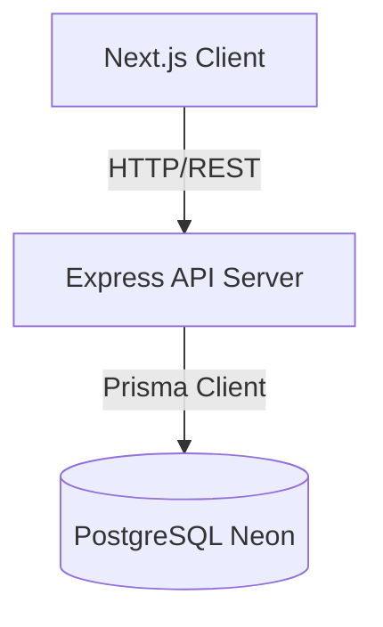

# System Architecture

## Overview
This is a standard decoupled architecture:
- **Frontend**: Next.js (TypeScript) deployed on Vercel
- **Backend**: Express.js (TypeScript) server
- **Database**: PostgreSQL hosted on Neon
- **ORM**: Prisma for schema management and querying

## Architecture Diagram

